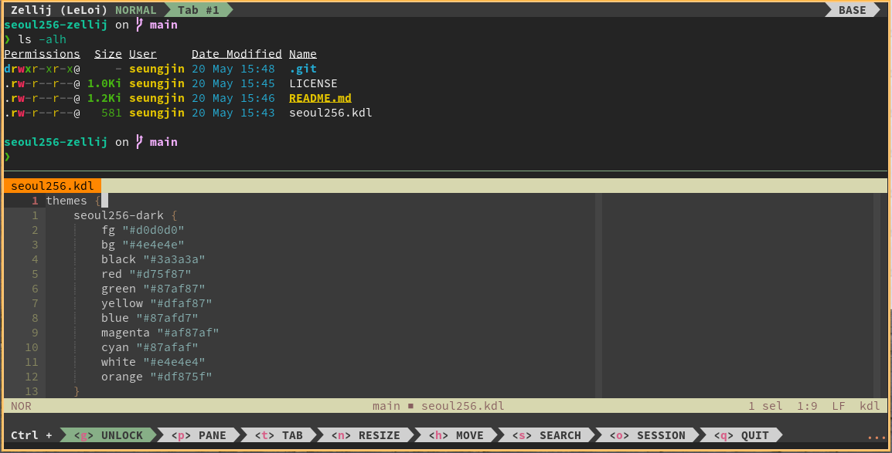

# seoul256-zellij

Low-contrast [Seoul256](https://github.com/junegunn/seoul256.vim) theme for [Zellij](https://zellij.dev/).


*Screenshot shows Zellij and Helix both using the seoul256 theme.*

This theme is based on the original **Seoul256** color scheme for Vim, created by [Junegunn Choi](https://github.com/junegunn).

## Variants

This package includes both Dark and Light variants:
- `seoul256-dark`
- `seoul256-light`

## Installation

1. Create a themes directory if it doesn't exist:
   ```bash
   mkdir -p ~/.config/zellij/themes
   ```

2. Copy `seoul256.kdl` into the themes directory:
   ```bash
   cp seoul256.kdl ~/.config/zellij/themes/seoul256.kdl
   ```

## Usage

Update your Zellij configuration file (usually `~/.config/zellij/config.kdl`) to use one of the variants:

```kdl
theme "seoul256-dark"
// OR
theme "seoul256-light"
```

If you haven't pointed Zellij to your themes directory, ensure your `config.kdl` includes:

```kdl
theme_dir "~/.config/zellij/themes"
```

## Preview

| Variant | Background | Foreground |
| :--- | :--- | :--- |
| **Dark** | `#4e4e4e` | `#d0d0d0` |
| **Light** | `#dadada` | `#4e4e4e` |

## Credits

- [seoul256.vim](https://github.com/junegunn/seoul256.vim) by [Junegunn Choi](https://github.com/junegunn).

## License

MIT
